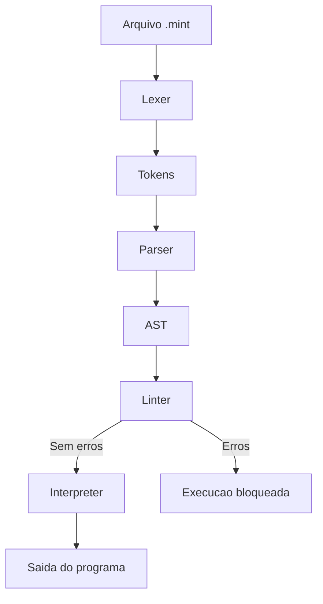

# Mint Language

## Visao geral
Mint e uma linguagem interpretada em Python com foco educacional. O projeto prioriza sintaxe clara, regras explicitas e uma arquitetura simples para demonstrar como uma linguagem funciona internamente.

## Objetivos
- Ensinar conceitos de compiladores e interpretadores de forma acessivel
- Manter tipagem forte e comportamento previsivel
- Evitar magia implicita e manter comandos explicitos
- Permitir evolucao gradual com baixo acoplamento

## Recursos atuais
- Estrutura formal de programa: `program init.` / `initialization.` / `endprogram.`
- Declaracao de variaveis tipadas com valores padrao
- Tipos: `int`, `float`, `string`, `char`, `bool`
- Expressoes aritmeticas com precedencia e parenteses
- Comparacoes com validacao de tipos
- Condicionais `if/elseif/else/endif`
- Atribuicao com `=` (respeitando tipo da variavel)
- Leitura de entrada com `input(var)` com conversao tipada
- Comando `move ... to ...` como atribuicao semantica
- Repeticao com `while/endwhile`
- Operadores logicos `and/or/not` com short-circuit
- Linter estatico antes da execucao
- Syntax highlighting via extensao do VS Code

## Estrutura do repositorio
- `mintlang/` core da linguagem (lexer, parser, AST, linter, interpreter)
- `vscode-mint/` extensao do VS Code
- `examples/` exemplos de programas Mint
- `task.md` historico de features

## Sintaxe basica
```mint
program init.
  var num type int = 10.
  var ok type bool = true.
initialization.
  while num < 15.
    write(num).
    num = num + 1.
  endwhile.
endprogram.
```

## Como executar
Requer Python 3.

```bash
python -m mintlang.cli examples/hello.mint
```

O linter roda antes da execucao. Se houver erros (ex: variavel nao declarada ou tipo invalido), o programa nao executa.

## Como a interpretacao funciona
O Mint executa o codigo em etapas claras. Cada etapa tem um papel unico e explicitamente definido:

1. Lexer: transforma o texto em tokens (palavras-chave, literais, operadores).
2. Parser: organiza os tokens em uma AST (arvore de sintaxe abstrata).
3. Linter: valida semantica e tipos antes da execucao.
4. Interpreter: percorre a AST e executa o programa.

Esse fluxo garante previsibilidade e facilita o entendimento do comportamento da linguagem.

### Diagrama do fluxo


## Extensao do VS Code
O projeto inclui uma extensao simples para destacar sintaxe. O pacote e mantido em `vscode-mint/`.
